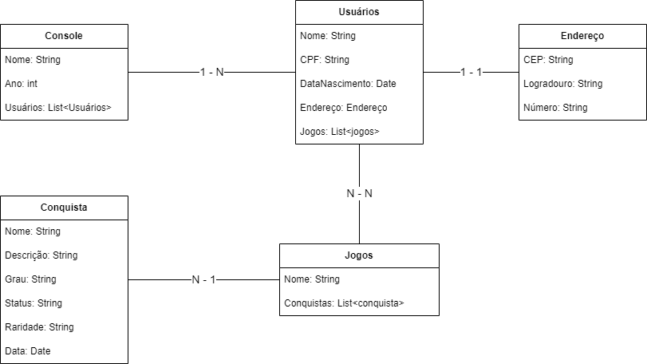

# Sistema de conquista de troféus (Playstation)

Os Trófeus da PlayStation Network surgiram em 2008, criando legiões de “Caçadores de Troféus”.
A presa mais cobiçada por esses caçadores de tesouros digitais é o Troféu de Platina.
Para os inexperientes, a maioria dos jogos em disco recompensa
os jogadores que desbloqueiam completamente uma longa lista de tarefas específicas no jogo
anexando um Troféu de Platina ao seu ID da PSN. É a maneira mais rápida de avaliar a habilidade
de outro jogador – embora qualquer pessoa consiga acumular uma grande quantidade de Troféus de
Bronze, a maior parte da Platinas exigem uma mistura de habilidade e dedicação.

## Projeto

Pensando nessa temática, esse projeto tem como objetivo
criar uma API REST que realize
a listagem, cadastro, edição e remoção de
usuários, jogos e conquistas de um console utilizando o
framework Spring Boot.

